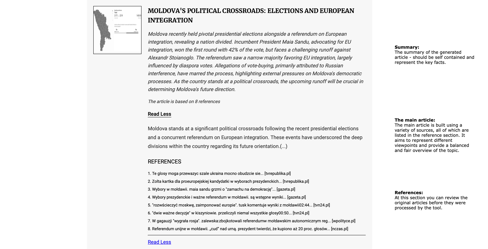

# ClearNews

The internet today is flooded with disinformation, biased opinions, and clickbait, making it difficult to find clear and unbiased information on current events. This tool is a small experiment aimed at addressing that challenge by gathering news from multiple sources, often representing contrasting points of view, and presenting them in a brief, concise, and hopefully fair manner.

## How it works
First, the main pages of various news services are analyzed to identify articles related to current events—during this stage, meaningless and clickbait articles are discarded, leaving only those that (hopefully) matter. The remaining articles are then grouped based on their similarity, even if they represent contrasting opinions, ensuring that each group represents a distinct topic. Finally, for each topic, an article is generated that summarizes the key opinions and facts, providing a balanced overview of the issue.

Here is an example article overview:

The current implementation supports Polish news services, including Gazeta.pl, TVN24, DoRzeczy, NaCzasie, and WPolityce. However, you can extend this by adding more services or focusing on news from other regions or countries by modifying or adding news scrapers in the sources.py file.

**Important**: News scraping may have legal implications. Please use this code responsibly and at your own risk. This repository is for demonstration purposes only, and no heavy or repetitive data scraping has been, or will ever be, conducted.

## Features

- **News Fetching**: Collects articles from various predefined news sources.
- **Clickability Filtering**: Uses a language model to predict the clickability of article titles and filters accordingly.
- **Content Retrieval**: Downloads the full content and images of the selected articles.
- **Summarization and Categorization**: Summarizes articles and assigns them to predefined categories.
- **Topic Clustering**: Groups articles into topics based on content similarity using embeddings.
- **Article Generation**: Creates comprehensive articles from clustered topics.
- **Logging**: Provides detailed logs for easy debugging and monitoring.

## Running the code

- **Python 3.7 or higher**
- **OpenAI API Key**: You need an OpenAI account and API key to use the language models.

Install dependencies

`pip install -r requirements.txt`

Set your OpenAI API key as an environment variable:

`export OPENAI_API_KEY='your_openai_api_key'`

Run the script to collect news (the result will be stored in  `data` directory)

`python create_articles.py`

Create `index.html` to enjoy your daily dose of news:

`python create_webpage.py`

Enjoy the news! Just open freshly generated `index.html` in your favorite browser.

## Contributing

This is a demo project with many aspects that can be further improved, including:

1. Adding more data sources
2. Enhancing the existing prompts
3. Supporting sources from multiple regions or countries
4. Making news categories adjustable
5. Improving the news reading layout
6. And many more possibilities!

If you're passionate about making the internet a better place, feel free to contribute!
